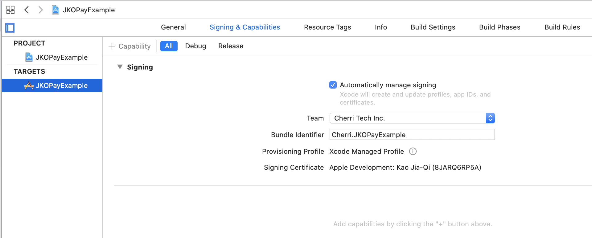
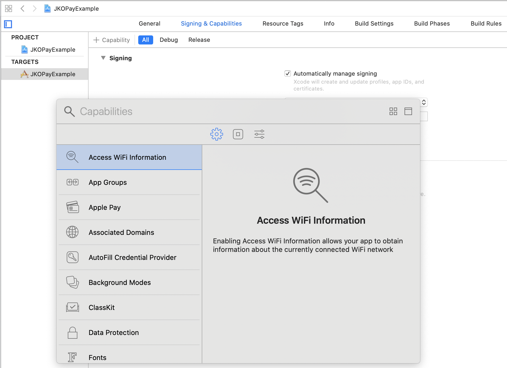
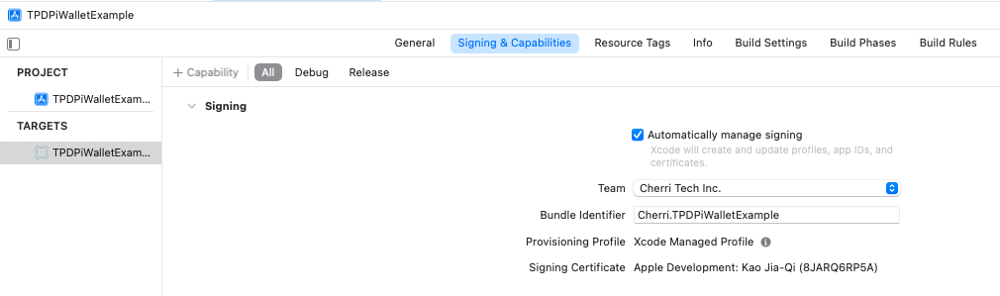
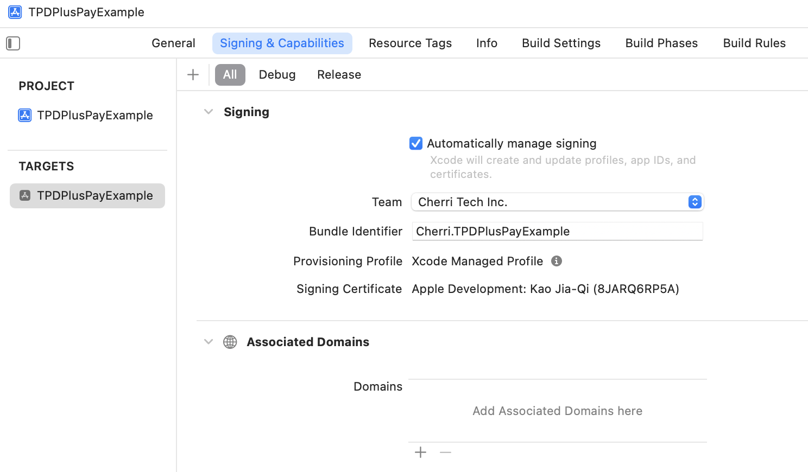

# tappay-iOS-example(Swift)

TapPay SDK Example Code for iOS Plateform.

TapPay iOS SDK is used to get token(i.e. prime) on iOS platform for charging a credit card.

> Obtain your app id and keys here. > https://www.tappaysdk.com/en

# Demo

      

# Usage

## Direct Pay
### 1. Import TPDirect.framework and TPDirectResource into your project.
### 2. Create a Bridging-Header.h file and Import TPDirect SDK
```objc
#import <TPDirect/TPDirect.h>
```
### 3. Use TPDSetup to set up your environment.

``` swift

func application(_ application: UIApplication, didFinishLaunchingWithOptions launchOptions: [UIApplicationLaunchOptionsKey: Any]?) -> Bool {

    TPDSetup.setWithAppId(APP_ID, withAppKey: "APP_KEY", with: TPDServerType.ServerType)
}
```

### 4. Add UIView in your Main.storyboard and initialize TPDForm.
```swift
self.tpdForm = TPDForm.setup(withContainer: Your View)
```
### 5. Setup TPDForm Text Color
```swift
tpdForm.setErrorColor(UIColor.red)
tpdForm.setOkColor(UIColor.green)
tpdForm.setNormalColor(UIColor.black)
```
### 6. Setup TPDForm onFormUpdated Callback get TPDForm Status, check is can get prime.

```swift
tpdForm.onFormUpdated { (status) in
    if (status.isCanGetPrime()) {
        // Can make payment.
    } else {
        // Can't make payment.
    }
}
```

### 7. Setup TPDForm display ccv field

```swift
// Default is true.
tpdForm.setIsUsedCcv(true) 
```

### 8. Use TPDForm to initialize TPDCard.
```swift
self.tpdCard = TPDCard.setup(self.tpdForm)
```
### 9. Use the getPrime() function in TPDCard to obtain the prime token.

```swift
tpdCard.onSuccessCallback { (prime, cardInfo, cardIdentifier) in

    print("Prime : \(prime!), cardInfo : \(cardInfo), cardIdentifier : \(cardIdentifier)")

}.onFailureCallback { (status, message) in

    print("status : \(status) , Message : \(message)")

}.getPrime()
```


## Apple Pay

### 1. Download and import TPDirect.framework into your project.

### 2. Create a Bridging-Header.h file Import TPDirect SDK
```objc
#import <TPDirect/TPDirect.h>
```
### 3. Import PassKit.framework into your project.
```swift
import PassKit
```
### 4. Enable Apple Pay in your Xcode and add Apple Merchant IDs.
### 5. Use TPDSetup to set up your environment.
```swift

func application(_ application: UIApplication, didFinishLaunchingWithOptions launchOptions: [UIApplicationLaunchOptionsKey: Any]?) -> Bool {

    TPDSetup.setWithAppId(APP_ID, withAppKey: "APP_KEY", with: TPDServerType.ServerType)

}
```
### 6. Create TPDMerchant for Apple Pay Merchant Information.
### 7. Create TPDConsumer for Apple Pay Consumer Information.
According to isAmountPending setting to decide use deferred payment or not, default is false.
According to isShowTotalAmount setting to decide Apple Pay total display amount or AMOUNT PENDING, default is true.


### 8. Create TPDCart for Apple Pay Cart Information.
### 9. Check Device Support Apple Pay.
```swift
TPDApplePay.canMakePayments()
```
### 10. Setup TPDApplePay with TPDMerchant, TPDConsumer and TPDCart.
```swift
TPDApplePay.setupWthMerchant(merchant, with: consumer, with: cart, withDelegate: self)
```
### 11. Start Payment.
```swift
applePay.startPayment()
```

### 12. Get Prime via delegate.
```swift
func tpdApplePay(_ applePay: TPDApplePay!, didReceivePrime prime: String!) {

    // 1. Send Your Prime To Your Server, And Handle Payment With Result

    print("Prime : \(prime!)");

    // 2. Handle Payment Result Success / Failure in Delegate.
    let paymentReault = true;
    applePay.showPaymentResult(paymentReault)

}
```

### 13. Handle Payment Success Result.
```swift
func tpdApplePay(_ applePay: TPDApplePay!, didSuccessPayment result: TPDTransactionResult!) {
    print("Apple Pay Did Success ==> Amount : \(result.amount.stringValue)")

    print("shippingContact.name : \(applePay.consumer.shippingContact?.name?.givenName) \( applePay.consumer.shippingContact?.name?.familyName)")
    print("shippingContact.emailAddress : \(applePay.consumer.shippingContact?.emailAddress)")
    print("shippingContact.phoneNumber : \(applePay.consumer.shippingContact?.phoneNumber?.stringValue)")

    print("Shipping Method.identifier : \(applePay.cart.shippingMethod.identifier)")
    print("Shipping Method.detail : \(applePay.cart.shippingMethod.detail)")

}
```

### 14. Handle Payment Failure Result.
```swift
func tpdApplePay(_ applePay: TPDApplePay!, didFailurePayment result: TPDTransactionResult!) {
    print("Apple Pay Did Failure ==> Message : \(result.message), ErrorCode : \(result.status)")
}
```


## LINE Pay
### 1. Download and import TPDirect.framework into your project.

### 2. Create a Bridging-Header.h file Import TPDirect SDK
```objc
#import <TPDirect/TPDirect.h>
```

### 3. Linked Framework and Libraries add SafariServices.framework

### 4. Use TPDSetup to set up your environment.
```swift

func application(_ application: UIApplication, didFinishLaunchingWithOptions launchOptions: [UIApplicationLaunchOptionsKey: Any]?) -> Bool {

    TPDSetup.setWithAppId(APP_ID, withAppKey: "APP_KEY", with: TPDServerType.ServerType)

}
```
### 5. Setup Custom URL Scheme
#### Step 1
Go into your app's info.plist file.
#### Step 2
Add a Row to this and call it "URL types"
#### Step 3
Expand the first item in "URL types" and add a row called "URL identifier", the value of this string should be the reverse domain for your app e.g. "com.yourcompany.myapp".
#### Step 4
Again, add a row into the first item in "URL types" and call it "URL Schemes"
#### Step 5
Inside "URL Schemes" you can use each item as a different url you wish to use, so if you wanted to use "myapp://" you would create an item called "myapp".


### 6. Setup Whitelisting URL Scheme
####  Step 1
Open Info.plist
#### Step 2
Add a Key named LSApplicationQueriesSchemes, and set the type of the value to Array
#### Step 3
Add an item of type String to the Array and set its value to line.


### Setup TPDLinePay
Use your custom URL Scheme to initialize TPDLinePay object.
```swift
TPDLinePay.setup(withReturnUrl: "You Custom URL SCheme")
```

### isLinePayAvailable
Check current device can use LINE Pay.
```swift
TPDLinePay.isLinePayAvailable()
```

### Install LINE App

```swift
TPDLinePay.installLineApp()
```

### Get Prime
Call getPrime function, via onSuccessCallback or onFailureCallbac to get prime or error message.

```Swift
linePay.onSuccessCallback { (prime) in
    print(prime : \(prime!))
}.onFailureCallback { (status, msg) in
    print("status : \(status), msg : \(msg)")
}.getPrime()
```
### Redirect to LINE Pay Payment Page

Obtain payment_url from TapPay, call redirect url function to LINE Pay Payment Page, get LINE Pay result via callback.
```Swift
linePay.redirect(with: paymentURL, viewController: self, completion: { (result) in

    print("stauts : \(result.status) , recTradeId : \(result.recTradeId) , bankTransactionId : \(result.bankTransactionId) , order_number : \(result.orderNumber)")

})
```

### Handle URL
Use this method handle URL come from TapPay and parse URL data.
( For version higher than iOS 9.0 )
```Swift
func application(_ app: UIApplication, open url: URL, options: [UIApplicationOpenURLOptionsKey : Any] = [:]) -> Bool {
    let tapPayHandled = TPDLinePay.handle(url)
    if (tapPayHandled) {
        return true
        }
    return false
}
```
( For version lower than iOS 9.0 )
```
func application(_ application: UIApplication, open url: URL, sourceApplication: String?, annotation: Any) -> Bool {
    let tapPayHandled = TPDLinePay.handle(url)
    if (tapPayHandled) {
        return true
    }

    return false
}
```
### Exception Handle
#### Step1
Implement addExceptionOberver function in AppDelegate didFinishLaunchingWithOptions to handle exception, .

```Swift
TPDLinePay.addExceptionObserver(#selector(tappayLinePayExceptionHandler(notofication:)))
```

#### Step2
In AppDelegate add tappayLinePayExceptionHandler function, when exception happened receive notification.

```Swift
@objc func tappayLinePayExceptionHandler(notofication: Notification) {

let result : TPDLinePayResult = TPDLinePay.parseURL(notofication)

print("status : \(result.status) , orderNumber : \(result.orderNumber) , recTradeid : \(result.recTradeId) , bankTransactionId : \(result.bankTransactionId) ")

}

```


## JKOPay

### 1. Download and import TPDirect.framework into your project.
### 2. Create a Bridging-Header.h file and Import TPDirect SDK
```swift
#import <TPDirect/TPDirect.h>
```

### 3. Use TPDSetup to set up your environment.
```

func application(_ application: UIApplication, didFinishLaunchingWithOptions launchOptions: [UIApplicationLaunchOptionsKey: Any]?) -> Bool {

    TPDSetup.setWithAppId(APP_ID, withAppKey: "APP_KEY", with: TPDServerType.ServerType)

}
```
### Setup universal link

#### step 1
Go to xCode TARGET and Signing & Capabilities page



#### step 2 
click + button and choose Associated Domains



#### step 3
In Associated Domains section click + button add domain

  

#### step 4 
Domain should be applink:{your domain without https://}


#### step 5 
Setup a config need to upload a file on your server.
You can use ngrok to test.
create a folder /.well-known in your server then create a file 'apple-app-site-association' 

appID format : <TeamID>.<bundle identifier>
```
{
    "applinks": {
        "apps": [],
        "details": [
            {
                "appID": "T9G64ZZGC4.Cherri.JKO-example",
                "paths": [ "*" ]
            }
        ]
    }
}
```
Get teamID from apple developer membership
<br>
Get bundle identifier from xCode


### Setup TPDJKOPay
Use your custom universal link to initialize TPDJKOPay object.
```siwft
let jkoPay = TPDJKOPay.setup(withReturnUrl: "Your universal link")
```

### Get Prime
Call getPrime function, via onSuccessCallback or onFailureCallbac to get prime or error message.


```swift
jkoPay.onSuccessCallback { (prime) in
    print(prime : \(prime!))
}.onFailureCallback { (status, msg) in
    print("status : \(status), msg : \(msg)")
}.getPrime()
```

### Redirect to JKOPay App 

Obtain payment_url from TapPay, call redirect url function to JKOPay App, get JKOPay result via callback.

```swift
jkoPay.redirect(payment_url) { (result) in
    print("status : \(result.status), rec_trade_id : \(result.recTradeId), order_number : \(result.orderNumber), bank_transaction_id : \(result.bankTransactionId)")
}
```

### Handle universal link

Use this method handle universal link come from TapPay and parse data. ( For version lower than iOS 13.0 )
```swift
- (BOOL)application:(UIApplication *)application continueUserActivity:(NSUserActivity *)userActivity restorationHandler:(void (^)(NSArray<id<UIUserActivityRestoring>> * _Nullable))restorationHandler {
    NSURL * url = userActivity.webpageURL;
    BOOL jkoHandled = [TPDJKOPay handleJKOUniversalLink:url];
    if (jkoHandled) {
        return YES;
    }
    return NO;
}

```

### Exception handle
#### step1

Implement addExceptionOberver function in AppDelegate didFinishLaunchingWithOptions to handle exception.

```swift
TPDJKOPay.addExceptionObserver(#selector(tappayJKOPayExceptionHandler(notofication:)))
```

#### step2

In AppDelegate add tappayJKOPayExceptionHandler function, when exception happened receive notification.

```swift

func tappayJKOPayExceptionHandler(notofication: Notification) {

let result : TPDJKOPayResult = TPDJKOPay.parseURL(notofication)

print("status : \(result.status) , orderNumber : \(result.orderNumber) , recTradeid : \(result.recTradeId) , bankTransactionId : \(result.bankTransactionId) ")

}

```


## Easy Wallet

### 1. Download and import TPDirect.framework into your project.
### 2. Create a Bridging-Header.h file and Import TPDirect SDK
```swift
#import <TPDirect/TPDirect.h>
```

### 3. Use TPDSetup to set up your environment.
```

func application(_ application: UIApplication, didFinishLaunchingWithOptions launchOptions: [UIApplicationLaunchOptionsKey: Any]?) -> Bool {

    TPDSetup.setWithAppId(APP_ID, withAppKey: "APP_KEY", with: TPDServerType.ServerType)

}
```
### Setup universal link

#### step 1
Go to xCode TARGET and Signing & Capabilities page


#### step 2 
click + button and choose Associated Domains


#### step 3
In Associated Domains section click + button add domain

  

#### step 4 
Domain should be applink:{your domain without https://}


#### step 5 
Setup a config need to upload a file on your server.
You can use ngrok to test.
create a folder /.well-known in your server then create a file 'apple-app-site-association' 

appID format : <TeamID>.<bundle identifier>
```
{
    "applinks": {
        "apps": [],
        "details": [
            {
                "appID": "T9G64ZZGC4.Cherri.EasyWalletExample",
                "paths": [ "*" ]
            }
        ]
    }
}
```
Get teamID from apple developer membership
<br>
Get bundle identifier from xCode


### Setup TPDEasyWallet
Use your custom universal link to initialize TPDEasyWallet object.
```siwft
let easyWallet = TPDEasyWallet.setup(withReturnUrl: "Your universal link")
```

### Get Prime
Call getPrime function, via onSuccessCallback or onFailureCallbac to get prime or error message.


```swift
easyWallet.onSuccessCallback { (prime) in
    print(prime : \(prime!))
}.onFailureCallback { (status, msg) in
    print("status : \(status), msg : \(msg)")
}.getPrime()
```

### Redirect to Easy Wallet App 

Obtain payment_url from TapPay, call redirect url function to EasyWallet App, get EasyWallet result via callback.

```swift
easyWallet.redirect(payment_url) { (result) in
    print("status : \(result.status), rec_trade_id : \(result.recTradeId), order_number : \(result.orderNumber), bank_transaction_id : \(result.bankTransactionId)")
}
```

### Handle universal link

Use this method handle universal link come from TapPay and parse data. ( For version lower than iOS 13.0 )
```swift
- (BOOL)application:(UIApplication *)application continueUserActivity:(NSUserActivity *)userActivity restorationHandler:(void (^)(NSArray<id<UIUserActivityRestoring>> * _Nullable))restorationHandler {
    NSURL * url = userActivity.webpageURL;
    BOOL easyWalletHandled = [TPDEasyWallet handleEasyWalletUniversalLink:url];
    if (easyWalletHandled) {
        return YES;
    }
    return NO;
}

```

### Exception handle
#### step1

Implement addExceptionOberver function in AppDelegate didFinishLaunchingWithOptions to handle exception.

```swift
TPDEasyWallet.addExceptionObserver(#selector(tappayEasyWalletExceptionHandler(notofication:)))
```

#### step2

In AppDelegate add tappayEasyWalletExceptionHandler function, when exception happened receive notification.

```swift

func tappayEasyWalletExceptionHandler(notofication: Notification) {

let result : TPDEasyWalletResult = TPDEasyWallet.parseURL(notofication)

print("status : \(result.status) , orderNumber : \(result.orderNumber) , recTradeid : \(result.recTradeId) , bankTransactionId : \(result.bankTransactionId) ")

}

```


## Direct Pay CCV Form

When using Pay by Card Token API, if you want to bring the ccv data which has been hashed to do transaction , you can use `TPDCcv` class `getPrime()` method to get the ccv_prime.
ps. ccv_prime is a random string. It can help you not to handling sensitive ccv data.


### 1. Setup CCV Form

Use this method to set display ccv field.

```swift
tpdCcvForm = TPDCcvForm.setupCCV(withContainer: ccvFormView)
```


### 2. Setup Card Type 

This method can verify the ccv format for different card type.
Ex: If this is a VISA card, we will check if the ccv length is three digits.

```swift
tpdCcvForm.setCCVForm(CardType.visa)
```

### 3. onCCVFormUpdated

Use this method to get the current status of ccv.

```swift
tpdCcvForm.onCCVFormUpdated { (status) in
  print("isCanGetCCVPrime : \(status!.isCanGetCCVPrime())")
}
```

### Setup TPDCcv

Use this method to initial TPDCcv object.

```swift
tpdCcv = TPDCcv.setup(ccvForm: TPDCcvForm)
```

### Get Prime

If calling getPrime() successfully, you will get prime from onSuccessCallback.
If failed, you will get error code and error message from onFailureCallback.

```swift
tpdCcv.onSuccessCallback { (prime) in
    // Send ccv_prime to Pay by card token API
}.onFailureCallback { (status, message) in
    print("status : \(status), message : \(message)")
}.getPrime()
```

## PiWallet

### 1. Download and import TPDirect.framework into your project.
### 2. Create a Bridging-Header.h file and Import TPDirect SDK
```swift
#import <TPDirect/TPDirect.h>
```

### 3. Use TPDSetup to set up your environment.
```

func application(_ application: UIApplication, didFinishLaunchingWithOptions launchOptions: [UIApplicationLaunchOptionsKey: Any]?) -> Bool {

    TPDSetup.setWithAppId(APP_ID, withAppKey: "APP_KEY", with: TPDServerType.ServerType)

}
```
### Setup universal link

#### step 1
Go to xCode TARGET and Signing & Capabilities page



#### step 2 
click + button and choose Associated Domains


#### step 3
In Associated Domains section click + button add domain

  

#### step 4 
Domain should be applink:{your domain without https://}


#### step 5 
Setup a config need to upload a file on your server.
You can use ngrok to test.
create a folder /.well-known in your server then create a file 'apple-app-site-association' 

appID format : <TeamID>.<bundle identifier>
```
{
    "applinks": {
        "apps": [],
        "details": [
            {
                "appID": "T9G64ZZGC4.Cherri.TPDPiWalletExample",
                "paths": [ "*" ]
            }
        ]
    }
}
```
Get teamID from apple developer membership
<br>
Get bundle identifier from xCode


### Setup TPDPiWallet
Use your custom universal link to initialize TPDPiWallet object.
```siwft
let piWallet = TPDPiWallet.setup(withReturnUrl: "Your universal link")
```

### Get Prime
Call getPrime function, via onSuccessCallback or onFailureCallbac to get prime or error message.


```swift
piWallet.onSuccessCallback { (prime) in
    print(prime : \(prime!))
}.onFailureCallback { (status, msg) in
    print("status : \(status), msg : \(msg)")
}.getPrime()
```

### Redirect to PiWallet App 

Obtain payment_url from TapPay, call redirect url function to PiWallet App, get PiWallet result via callback.

```swift
piWallet.redirect(payment_url) { (result) in
    print("status : \(result.status), rec_trade_id : \(result.recTradeId), order_number : \(result.orderNumber), bank_transaction_id : \(result.bankTransactionId)")
}
```

### Handle universal link

Use this method handle universal link come from TapPay and parse data. ( For version lower than iOS 13.0 )
```swift
- (BOOL)application:(UIApplication *)application continueUserActivity:(NSUserActivity *)userActivity restorationHandler:(void (^)(NSArray<id<UIUserActivityRestoring>> * _Nullable))restorationHandler {
    NSURL * url = userActivity.webpageURL;
    BOOL piWalletHandled = [TPDPiWallet handlePiWalletUniversalLink:url];
    if (piWalletHandled) {
        return YES;
    }
    return NO;
}

```

### Exception handle
#### step1

Implement addExceptionOberver function in AppDelegate didFinishLaunchingWithOptions to handle exception.

```swift
TPDPiWallet.addExceptionObserver(#selector(tappayPiWalletExceptionHandler(notofication:)))
```

#### step2

In AppDelegate add tappayPiWalletExceptionHandler function, when exception happened receive notification.

```swift

func tappayPiWalletExceptionHandler(notofication: Notification) {

let result : TPDPiWalletResult = TPDPiWallet.parseURL(notofication)

print("status : \(result.status) , orderNumber : \(result.orderNumber) , recTradeid : \(result.recTradeId) , bankTransactionId : \(result.bankTransactionId) ")

}

```

## Plus Pay

### 1. Download and import TPDirect.framework into your project.
### 2. Create a Bridging-Header.h file and Import TPDirect SDK
```swift
#import <TPDirect/TPDirect.h>
```

### 3. Use TPDSetup to set up your environment.
```

func application(_ application: UIApplication, didFinishLaunchingWithOptions launchOptions: [UIApplicationLaunchOptionsKey: Any]?) -> Bool {

    TPDSetup.setWithAppId(APP_ID, withAppKey: "APP_KEY", with: TPDServerType.ServerType)

}
```
### Setup universal link

#### step 1
Go to xCode TARGET and Signing & Capabilities page


#### step 2 
click + button and choose Associated Domains


#### step 3
In Associated Domains section click + button add domain

  

#### step 4 
Domain should be applink:{your domain without https://}


#### step 5 
Setup a config need to upload a file on your server.
You can use ngrok to test.
create a folder /.well-known in your server then create a file 'apple-app-site-association' 

appID format : <TeamID>.<bundle identifier>
```
{
    "applinks": {
        "apps": [],
        "details": [
            {
                "appID": "T9G64ZZGC4.Cherri.TPDPlusPayExample",
                "paths": [ "*" ]
            }
        ]
    }
}
```
Get teamID from apple developer membership
<br>
Get bundle identifier from xCode


### Setup TPDPlusPay
Use your custom universal link to initialize TPDPlusPay object.
```siwft
let plusPay = TPDPlusPay.setup(withReturnUrl: "Your universal link")
```

### Get Prime
Call getPrime function, via onSuccessCallback or onFailureCallbac to get prime or error message.


```swift
plusPay.onSuccessCallback { (prime) in
    print(prime : \(prime!))
}.onFailureCallback { (status, msg) in
    print("status : \(status), msg : \(msg)")
}.getPrime()
```

### Redirect to Family Mart App 

Obtain payment_url from TapPay, call redirect url function to Family Mart App, get Plus Pay result via callback.

```swift
plusPay.redirect(payment_url) { (result) in
    print("status : \(result.status), rec_trade_id : \(result.recTradeId), order_number : \(result.orderNumber), bank_transaction_id : \(result.bankTransactionId)")
}
```

### Handle universal link

Use this method handle universal link come from TapPay and parse data. ( For version lower than iOS 13.0 )
```swift
- (BOOL)application:(UIApplication *)application continueUserActivity:(NSUserActivity *)userActivity restorationHandler:(void (^)(NSArray<id<UIUserActivityRestoring>> * _Nullable))restorationHandler {
    NSURL * url = userActivity.webpageURL;
    BOOL plusPayHandled = [TPDPlusPay handlePlusPayUniversalLink:url];
    if (plusPayHandled) {
        return YES;
    }
    return NO;
}

```

### Exception handle
#### step1

Implement addExceptionOberver function in AppDelegate didFinishLaunchingWithOptions to handle exception.

```swift
TPDPlusPay.addExceptionObserver(#selector(tappayPlusPayExceptionHandler(notofication:)))
```

#### step2

In AppDelegate add tappayPlusPayExceptionHandler function, when exception happened receive notification.

```swift

func tappayPlusPayExceptionHandler(notofication: Notification) {

let result : TPDPlusPayResult = TPDPlusPay.parseURL(notofication)

print("status : \(result.status) , orderNumber : \(result.orderNumber) , recTradeid : \(result.recTradeId) , bankTransactionId : \(result.bankTransactionId) ")

}

```


## PXPay Plus

### 1. Download and import TPDirect.framework into your project.
### 2. Create a Bridging-Header.h file and Import TPDirect SDK
```swift
#import <TPDirect/TPDirect.h>
```

### 3. Use TPDSetup to set up your environment.
```

func application(_ application: UIApplication, didFinishLaunchingWithOptions launchOptions: [UIApplicationLaunchOptionsKey: Any]?) -> Bool {

    TPDSetup.setWithAppId(APP_ID, withAppKey: "APP_KEY", with: TPDServerType.ServerType)

}
```
### Setup universal link

#### step 1
Go to xCode TARGET and Signing & Capabilities page


#### step 2 
click + button and choose Associated Domains


#### step 3
In Associated Domains section click + button add domain

  

#### step 4 
Domain should be applink:{your domain without https://}


#### step 5 
Setup a config need to upload a file on your server.
You can use ngrok to test.
create a folder /.well-known in your server then create a file 'apple-app-site-association' 

appID format : <TeamID>.<bundle identifier>
```
{
    "applinks": {
        "apps": [],
        "details": [
            {
                "appID": "T9G64ZZGC4.Cherri.TPDPxPayPlusExample",
                "paths": [ "*" ]
            }
        ]
    }
}
```
Get teamID from apple developer membership
<br>
Get bundle identifier from xCode


### Setup TPDPxPayPlus
Use your custom universal link to initialize TPDPxPayPlus object.
```siwft
let pxPayPlus = TPDPxPayPlus.setup(withReturnUrl: "Your universal link")
```

### Get Prime
Call getPrime function, via onSuccessCallback or onFailureCallbac to get prime or error message.


```swift
pxPayPlus.onSuccessCallback { (prime) in
    print(prime : \(prime!))
}.onFailureCallback { (status, msg) in
    print("status : \(status), msg : \(msg)")
}.getPrime()
```

### Redirect to PXPay Plus App 

Obtain payment_url from TapPay, call redirect url function to PXPay Plus App, get PXPay Plus result via callback.

```swift
pxPayPlus.redirect(payment_url) { (result) in
    print("status : \(result.status), rec_trade_id : \(result.recTradeId), order_number : \(result.orderNumber), bank_transaction_id : \(result.bankTransactionId)")
}
```

### Handle universal link

Use this method handle universal link come from TapPay and parse data. ( For version lower than iOS 13.0 )
```swift
- (BOOL)application:(UIApplication *)application continueUserActivity:(NSUserActivity *)userActivity restorationHandler:(void (^)(NSArray<id<UIUserActivityRestoring>> * _Nullable))restorationHandler {
    NSURL * url = userActivity.webpageURL;
    BOOL pxPayPlusHandled = [TPDPxPayPlus handlePxPayPlusUniversalLink:url];
    if (pxPayPlusHandled) {
        return YES;
    }
    return NO;
}

```

### Exception handle
#### step1

Implement addExceptionOberver function in AppDelegate didFinishLaunchingWithOptions to handle exception.

```swift
TPDPxPayPlus.addExceptionObserver(#selector(tappayPxPayPlusExceptionHandler(notofication:)))
```

#### step2

In AppDelegate add tappayPxPayPlusExceptionHandler function, when exception happened receive notification.

```swift

func tappayPxPayPlusExceptionHandler(notofication: Notification) {

let result : TPDPxPayPlusResult = TPDPxPayPlus.parseURL(notofication)

print("status : \(result.status) , orderNumber : \(result.orderNumber) , recTradeid : \(result.recTradeId) , bankTransactionId : \(result.bankTransactionId) ")

}

```

## iPASS MONEY

### 1. Download and import TPDirect.framework into your project.
### 2. Create a Bridging-Header.h file and Import TPDirect SDK
```swift
#import <TPDirect/TPDirect.h>
```

### 3. Use TPDSetup to set up your environment.
```

func application(_ application: UIApplication, didFinishLaunchingWithOptions launchOptions: [UIApplicationLaunchOptionsKey: Any]?) -> Bool {

    TPDSetup.setWithAppId(APP_ID, withAppKey: "APP_KEY", with: TPDServerType.ServerType)

}
```
### Setup universal link

#### step 1
Go to xCode TARGET and Signing & Capabilities page


#### step 2
click + button and choose Associated Domains


#### step 3
In Associated Domains section click + button add domain


#### step 4
Domain should be applink:{your domain without https://}


#### step 5
Setup a config need to upload a file on your server.
You can use ngrok to test.
create a folder /.well-known in your server then create a file 'apple-app-site-association'

appID format : <TeamID>.<bundle identifier>
```
{
    "applinks": {
        "apps": [],
        "details": [
            {
                "appID": "T9G64ZZGC4.Cherri.TPDIPassMoneyExample",
                "paths": [ "*" ]
            }
        ]
    }
}
```
Get teamID from apple developer membership
<br>
Get bundle identifier from xCode


### Setup TPDIPassMoney
Use your custom universal link to initialize TPDIPassMoney object.
```siwft
let iPassMoney = TPDIPassMoney.setup(withReturnUrl: "Your universal link")
```

### Get Prime
Call getPrime function, via onSuccessCallback or onFailureCallbac to get prime or error message.


```swift
iPassMoney.onSuccessCallback { (prime) in
    print(prime : \(prime!))
}.onFailureCallback { (status, msg) in
    print("status : \(status), msg : \(msg)")
}.getPrime()
```

### Redirect to iPASS MONEY App

Obtain payment_url from TapPay, call redirect url function to iPASS MONEY App, get iPASS MONEY result via callback.

```swift
iPassMoney.redirect(payment_url) { (result) in
    print("status : \(result.status), rec_trade_id : \(result.recTradeId), order_number : \(result.orderNumber), bank_transaction_id : \(result.bankTransactionId)")
}
```

### Handle universal link

Use this method handle universal link come from TapPay and parse data. ( For version lower than iOS 13.0 )
```swift
- (BOOL)application:(UIApplication *)application continueUserActivity:(NSUserActivity *)userActivity restorationHandler:(void (^)(NSArray<id<UIUserActivityRestoring>> * _Nullable))restorationHandler {
    NSURL * url = userActivity.webpageURL;
    BOOL iPassMoneyHandled = [TPDIPassMoney handleIPassMoneyUniversalLink:url];
    if (iPassMoneyHandled) {
        return YES;
    }
    return NO;
}

```

### Exception handle
#### step1

Implement addExceptionOberver function in AppDelegate didFinishLaunchingWithOptions to handle exception.

```swift
TPDIPassMoney.addExceptionObserver(#selector(tappayIPassMoneyExceptionHandler(notofication:)))
```

#### step2

In AppDelegate add tappayIPassMoneyExceptionHandler function, when exception happened receive notification.

```swift

func tappayIPassMoneyExceptionHandler(notofication: Notification) {

let result : TPDIPassMoneyResult = TPDIPassMoney.parseURL(notofication)

print("status : \(result.status) , orderNumber : \(result.orderNumber) , recTradeid : \(result.recTradeId) , bankTransactionId : \(result.bankTransactionId) ")

}

```

## Aftee
### 1. Download and import TPDirect.xcframework into your project.

### 2. Use TPDSetup to set up your environment.
```swift

func application(_ application: UIApplication, didFinishLaunchingWithOptions launchOptions: [UIApplicationLaunchOptionsKey: Any]?) -> Bool {

    TPDSetup.setWithAppId(APP_ID, withAppKey: "APP_KEY", with: TPDServerType.ServerType)

}
```
### 3. Setup Custom URL Scheme
#### Step 1
Go into your app's info.plist file.
#### Step 2
Add a Row to this and call it "URL types"
#### Step 3
Expand the first item in "URL types" and add a row called "URL identifier", the value of this string should be the reverse domain for your app e.g. "com.yourcompany.myapp".
#### Step 4
Again, add a row into the first item in "URL types" and call it "URL Schemes"
#### Step 5
Inside "URL Schemes" you can use each item as a different url you wish to use, so if you wanted to use "myapp://" you would create an item called "myapp".


### Setup TPDAftee
Use your custom URL Scheme to initialize TPDAftee object.
```swift
TPDAftee.setup(withReturnUrl: "You Custom URL SCheme")
```

### Get Prime
Call getPrime function, via onSuccessCallback or onFailureCallback to get prime or error message.

```Swift
aftee.onSuccessCallback { (prime) in
    print(prime : \(prime!))
}.onFailureCallback { (status, msg) in
    print("status : \(status), msg : \(msg)")
}.getPrime()
```
### Redirect to Aftee Payment Page

Obtain payment_url from TapPay, call redirect url function to Aftee Payment Page, get Aftee result via callback.
```Swift
aftee.redirect("paymentUrl") { (result) in

    print("stauts : \(result.status) , recTradeId : \(result.recTradeId) , bankTransactionId : \(result.bankTransactionId) , order_number : \(result.orderNumber)")

})
```

### Handle URL
Use this method handle URL come from TapPay and parse URL data.
( For version higher than iOS 9.0 )
```Swift
func application(_ app: UIApplication, open url: URL, options: [UIApplicationOpenURLOptionsKey : Any] = [:]) -> Bool {
    let afteeHandled = TPDAftee.handle(url)
    if (afteeHandled) {
        return true
        }
    return false
}
```
( For version lower than iOS 9.0 )
```
func application(_ application: UIApplication, open url: URL, sourceApplication: String?, annotation: Any) -> Bool {
    let afteeHandled = TPDAftee.handle(url)
    if (afteeHandled) {
        return true
    }

    return false
}
```
### Exception Handle
#### Step1
Implement addExceptionOberver function in AppDelegate didFinishLaunchingWithOptions to handle exception, .

```Swift
TPDAftee.addExceptionObserver(#selector(tappayAfteeExceptionHandler(notofication:)))
```

#### Step2
In AppDelegate add tappayLinePayExceptionHandler function, when exception happened receive notification.

```Swift
@objc func tappayAfteeExceptionHandler(notofication: Notification) {

let result : TPDAfteeResult = TPDAftee.parseURL(notofication)

    print("status : \(result.status) , orderNumber : \(result.orderNumber) , recTradeid : \(result.recTradeId) , bankTransactionId : \(result.bankTransactionId) ")

}

```

## Cardholder
### 1. Import TPDirect.framework and TPDirectResource into your project.
### 2. Create a Bridging-Header.h file and Import TPDirect SDK
```objc
#import <TPDirect/TPDirect.h>
```
### 3. Use TPDSetup to set up your environment.

``` swift

func application(_ application: UIApplication, didFinishLaunchingWithOptions launchOptions: [UIApplicationLaunchOptionsKey: Any]?) -> Bool {

    TPDSetup.setWithAppId(APP_ID, withAppKey: "APP_KEY", with: TPDServerType.ServerType)
}
```

### 4. Add UIView in your Main.storyboard and initialize TPDCardholderForm.
```swift
self.tpdCardholderForm = TPDCardholderForm.setup(withContainer: Your View)
```
### 5. Setup TPDCardholderForm Text Color
```swift
tpdCardholderForm.setErrorColor(UIColor.red)
tpdCardholderForm.setOkColor(UIColor.green)
tpdCardholderForm.setNormalColor(UIColor.black)
```
### 6. Setup TPDCardholderForm onFormUpdated Callback get TPDForm Status, check is can get prime.

```swift
tpdCardholderForm.onFormUpdated { (status) in
    if (status.isCanGetCardholderPrime()) {
        // Can make payment.
    } else {
        // Can't make payment.
    }
}
```

### 7. Setup TPDCardholderForm display email, phone number field

```swift
// Default is true.
tpdCardholderForm.setShowEmailField(false)
tpdCardholderForm.setShowPhoneNumberField(false)
```

### 8. Use the getPrime() function in TPDCardholderForm to obtain the prime token.

```swift
tpdCardholderForm.onSuccessCallback { (prime, status, message) in

    print("Prime : \(prime!), status : \(status), message : \(message)")

}.onFailureCallback { (status, message) in

    print("status : \(status) , Message : \(message)")

}.getCardholderPrime()
```


## OPPay
### 1. Download and import TPDirect.xcframework into your project.

### 2. Use TPDSetup to set up your environment.
```swift

func application(_ application: UIApplication, didFinishLaunchingWithOptions launchOptions: [UIApplicationLaunchOptionsKey: Any]?) -> Bool {

    TPDSetup.setWithAppId(APP_ID, withAppKey: "APP_KEY", with: TPDServerType.ServerType)

}
```
### 3. Setup Custom URL Scheme
#### Step 1
Go into your app's info.plist file.
#### Step 2
Add a Row to this and call it "URL types"
#### Step 3
Expand the first item in "URL types" and add a row called "URL identifier", the value of this string should be the reverse domain for your app e.g. "com.yourcompany.myapp".
#### Step 4
Again, add a row into the first item in "URL types" and call it "URL Schemes"
#### Step 5
Inside "URL Schemes" you can use each item as a different url you wish to use, so if you wanted to use "myapp://" you would create an item called "myapp".


### Setup TPDOpPay
Use your custom URL Scheme to initialize TPDOpPay object.
```swift
TPDOpPay.setup(withReturnUrl: "You Custom URL SCheme")
```

### Get Prime
Call getPrime function, via onSuccessCallback or onFailureCallback to get prime or error message.

```Swift
oppay.onSuccessCallback { (prime) in
    print(prime : \(prime!))
}.onFailureCallback { (status, msg) in
    print("status : \(status), msg : \(msg)")
}.getPrime()
```
### Redirect to OPPay Payment Page

Obtain payment_url from TapPay, call redirect url function to OPPay Payment Page, get OPPay result via callback.
```Swift
oppay.redirect("paymentUrl") { (result) in

    print("stauts : \(result.status) , recTradeId : \(result.recTradeId) , bankTransactionId : \(result.bankTransactionId) , order_number : \(result.orderNumber)")

})
```

### Handle URL
Use this method handle URL come from TapPay and parse URL data.
( For version higher than iOS 9.0 )
```Swift
func application(_ app: UIApplication, open url: URL, options: [UIApplicationOpenURLOptionsKey : Any] = [:]) -> Bool {
    let oppayHandled = TPDOpPay.handle(url)
    if (oppayHandled) {
        return true
        }
    return false
}
```
( For version lower than iOS 9.0 )
```
func application(_ application: UIApplication, open url: URL, sourceApplication: String?, annotation: Any) -> Bool {
    let oppayHandled = TPDOpPay.handle(url)
    if (oppayHandled) {
        return true
    }

    return false
}
```
### Exception Handle
#### Step1
Implement addExceptionOberver function in AppDelegate didFinishLaunchingWithOptions to handle exception, .

```Swift
TPDOpPay.addExceptionObserver(#selector(tappayOpPayExceptionHandler(notofication:)))
```

#### Step2
In AppDelegate add tappayLinePayExceptionHandler function, when exception happened receive notification.

```Swift
@objc func tappayOpPayExceptionHandler(notofication: Notification) {

let result : TPDOPPayResult = TPDOpPay.parseURL(notofication)

    print("status : \(result.status) , orderNumber : \(result.orderNumber) , recTradeid : \(result.recTradeId) , bankTransactionId : \(result.bankTransactionId) ")

}

```
